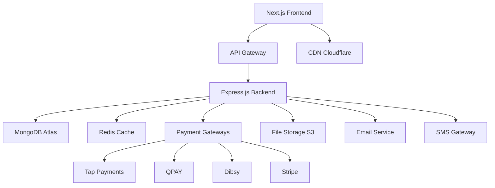

# 🛒 Picksmart Stores - Qatar's Premier Smart Shopping Platform

[](https://nextjs.org/)
[](https://www.typescriptlang.org/)
[](https://tailwindcss.com/)
[](https://www.mongodb.com/)
[](https://opensource.org/licenses/MIT)

> **A modern, bilingual (Arabic/English) ecommerce platform designed specifically for Qatar market, combining contemporary design principles with deep local cultural understanding and comprehensive GCC payment integration.**

## 🚀 Quick Start

```bash
# Clone the repository
git clone https://github.com/your-org/picksmart-stores.git
cd picksmart-stores

# Install dependencies
npm install

# Setup environment variables
cp .env.example .env.local

# Run development server
npm run dev
```

Visit [http://localhost:3000](http://localhost:3000) to see the application.

## 📋 Table of Contents

- [🎯 Project Overview](#-project-overview)
- [🏗️ Architecture](#️-architecture)
- [🚀 Getting Started](#-getting-started)
- [📁 Project Structure](#-project-structure)
- [🛠️ Development](#️-development)
- [🌍 Localization](#-localization)
- [💳 Payment Integration](#-payment-integration)
- [🔒 Security](#-security)
- [📱 Mobile First](#-mobile-first)
- [🚢 Deployment](#-deployment)
- [📚 Documentation](#-documentation)
- [🎨 Design Reference](#-design-reference)
- [🤝 Contributing](#-contributing)

## 🎯 Project Overview

### Design Reference Note
This project uses boat website's modern design patterns as **UI/UX reference only** to inspire contemporary e-commerce experiences. Our actual vision, brand identity, target market, and business goals are completely different and specifically tailored for Qatar-focused GCC smart shopping market.

### Vision
Create a Qatar-focused smart shopping platform that serves the entire GCC region, delivering exceptional experiences for diverse product categories through modern design principles while respecting local culture and providing comprehensive GCC market integration.

### Key Features
- **🎨 Modern UI Design** - Dynamic carousels, smooth interactions, contemporary aesthetics inspired by leading e-commerce platforms
- **🌐 Bilingual Excellence** - Native Arabic (RTL) and English interfaces with cultural sensitivity
- **💳 GCC Payment Integration** - QPAY, Tap Payments, Dibsy, and regional payment gateways
- **📱 GCC-Ready Mobile** - Optimized for high-speed mobile infrastructure across GCC countries
- **🛡️ Banking Grade Security** - PCI DSS compliant with GCC banking requirements
- **⚡ Performance Excellence** - 90+ Lighthouse scores with sub-3s load times region-wide
- **🛒 Smart Shopping Experience** - AI-powered search, advanced filters, personalized recommendations
- **🇶🇦 Regional Integration** - Multi-country shipping, local holidays, prayer times awareness across GCC
- **📦 Flexible Product Catalog** - Scalable platform supporting diverse product categories for the GCC market

### Target Market
- **Primary**: Qatar residents and expatriates (Arabic & English speakers)
- **Secondary**: GCC region customers (UAE, Saudi Arabia, Kuwait, Bahrain, Oman)
- **Demographics**: Smart shoppers, professionals, families, students (18-45 years) across GCC
- **Shopping Focus**: Quality lifestyle products, everyday essentials, trending items

## 🏗️ Architecture

### Technology Stack

#### Frontend
- **Framework**: Next.js 14 (App Router)
- **Language**: TypeScript 5.3
- **Styling**: Tailwind CSS 3.4 + RTL Plugin
- **UI Components**: Radix UI + Custom Design System
- **Animations**: Framer Motion 11
- **State Management**: Zustand
- **Data Fetching**: TanStack Query (React Query v5)

#### Backend
- **Runtime**: Node.js 20 (ESM modules)
- **Framework**: Express.js with TypeScript
- **Database**: MongoDB 7.2 with Change Streams
- **ORM**: Prisma
- **Caching**: Redis 7.2
- **Authentication**: NextAuth.js 5.0

#### Payment Gateways
- **Primary**: Tap Payments (MENA-focused)
- **Local**: QPAY (Qatar National Payment Gateway)
- **Alternative**: Dibsy (Local Qatar solution)
- **International**: Stripe (Global backup)

#### Infrastructure
- **Hosting**: Vercel (Frontend) + AWS (Backend)
- **CDN**: Cloudflare
- **Monitoring**: Sentry + DataDog
- **Analytics**: Google Analytics 4 + Custom Dashboard

### System Architecture Diagram



## 🚀 Getting Started

### Prerequisites
- Node.js 20+ and npm
- MongoDB 7.2+ (or MongoDB Atlas account)
- Redis 7.2+ (or Redis Cloud account)
- Git

### Installation

1. **Clone and Setup**
```bash
git clone https://github.com/your-org/picksmart-stores.git
cd picksmart-stores
npm install
```

2. **Environment Configuration**
```bash
cp .env.example .env.local
```

Configure the following environment variables:
```env
# Database
DATABASE_URL="mongodb://localhost:27017/picksmart"
REDIS_URL="redis://localhost:6379"

# Authentication
NEXTAUTH_SECRET="your-secret-key"
NEXTAUTH_URL="http://localhost:3000"

# Payment Gateways
TAP_SECRET_KEY="your-tap-secret-key"
QPAY_MERCHANT_ID="your-qpay-merchant-id"
QPAY_SECRET_KEY="your-qpay-secret"
DIBSY_API_KEY="your-dibsy-api-key"
STRIPE_SECRET_KEY="your-stripe-secret"

# Shipping APIs
QATAR_POST_API_KEY="your-qatar-post-key"
UAE_POST_API_KEY="your-uae-shipping-key"
SAUDI_POST_API_KEY="your-saudi-shipping-key"

# File Storage
AWS_ACCESS_KEY_ID="your-aws-access-key"
AWS_SECRET_ACCESS_KEY="your-aws-secret-key"
AWS_S3_BUCKET="your-s3-bucket"

# Email & SMS
SENDGRID_API_KEY="your-sendgrid-key"
SMS_GATEWAY_API_KEY="your-sms-api-key"
```

3. **Database Setup**
```bash
# Generate Prisma client
npx prisma generate

# Run database migrations
npx prisma db push

# Seed database with sample data
npm run db:seed
```

4. **Development Server**
```bash
npm run dev
```

### Development Scripts

```bash
# Development
npm run dev              # Start development server
npm run build            # Build for production
npm run start            # Start production server
npm run lint             # Run ESLint
npm run type-check       # TypeScript checking

# Database
npm run db:studio        # Open Prisma Studio
npm run db:seed          # Seed database
npm run db:migrate       # Run migrations
npm run db:reset         # Reset database

# Testing
npm run test             # Run unit tests
npm run test:e2e         # Run E2E tests
npm run test:coverage    # Generate coverage report

# Deployment
npm run deploy:staging   # Deploy to staging
npm run deploy:prod      # Deploy to production
```

## 📁 Project Structure

```
picksmart-stores/
├── 📁 apps/
│   ├── 📁 web/                    # Next.js frontend application
│   │   ├── 📁 app/               # App router pages
│   │   ├── 📁 components/        # React components
│   │   ├── 📁 lib/               # Utility functions
│   │   ├── 📁 hooks/             # Custom React hooks
│   │   ├── 📁 store/             # Zustand stores
│   │   └── 📁 styles/            # Global styles
│   ├── 📁 api/                    # Express.js backend
│   │   ├── 📁 src/
│   │   │   ├── 📁 routes/        # API routes
│   │   │   ├── 📁 controllers/   # Route controllers
│   │   │   ├── 📁 services/      # Business logic
│   │   │   ├── 📁 models/        # Database models
│   │   │   ├── 📁 middleware/    # Custom middleware
│   │   │   └── 📁 utils/         # Helper functions
│   │   └── 📁 prisma/            # Database schema
│   └── 📁 admin/                  # Admin dashboard
├── 📁 packages/
│   ├── 📁 ui/                     # Shared UI components
│   ├── 📁 config/                 # Shared configurations
│   ├── 📁 types/                  # TypeScript type definitions
│   └── 📁 utils/                  # Shared utilities
├── 📁 docs/                       # Documentation
├── 📁 scripts/                    # Build and deployment scripts
├── 📁 tests/                      # Test files
└── 📁 tools/                      # Development tools
```

## 🛠️ Development

### Code Style & Standards

- **ESLint + Prettier** for code formatting
- **Husky** for pre-commit hooks
- **TypeScript Strict Mode** enabled
- **Conventional Commits** for commit messages

### Component Development

```typescript
// Component template structure
interface ComponentProps {
  children?: React.ReactNode;
  className?: string;
  locale?: 'en' | 'ar';
  dir?: 'ltr' | 'rtl';
}

export default function Component({
  children,
  className,
  locale = 'en',
  dir = 'ltr',
  ...props
}: ComponentProps) {
  return (
    <div 
      dir={dir}
      className={cn(
        'base-styles',
        locale === 'ar' && 'arabic-styles',
        className
      )}
      {...props}
    >
      {children}
    </div>
  )
}
```

### API Route Standards

```typescript
// Standard API route structure
export async function GET(request: NextRequest) {
  try {
    // Input validation
    const { searchParams } = new URL(request.url);
    const page = searchParams.get('page') || '1';
    
    // Business logic
    const result = await businessLogic();
    
    // Response formatting
    return NextResponse.json({
      success: true,
      data: result,
      pagination: { page: Number(page) }
    });
  } catch (error) {
    console.error('API Error:', error);
    return NextResponse.json(
      { success: false, error: 'Internal server error' },
      { status: 500 }
    );
  }
}
```

## 🌍 Localization

### Supported Languages
- **Arabic (ar)** - Primary language with RTL support
- **English (en)** - Secondary language

### Implementation
```typescript
// i18n configuration
const i18nConfig = {
  locales: ['en', 'ar'],
  defaultLocale: 'en',
  domains: [
    { domain: 'picksmartstores.com', defaultLocale: 'en' },
    { domain: 'ar.picksmartstores.com', defaultLocale: 'ar' }
  ]
};
```

### Translation Files Structure
```
locales/
├── en/
│   ├── common.json
│   ├── products.json
│   ├── checkout.json
│   └── errors.json
└── ar/
    ├── common.json
    ├── products.json
    ├── checkout.json
    └── errors.json
```

## 💳 Payment Integration

### Supported Payment Methods

1. **Tap Payments** (Primary - MENA focused)
   - Credit/Debit cards
   - Digital wallets
   - Local payment methods (mada, KNET)

2. **QPAY** (Qatar National Payment Gateway)
   - Local debit cards
   - Qatar-specific integration

3. **Dibsy** (Alternative local solution)
   - Local payment processing
   - QCB licensed

4. **Stripe** (International backup)
   - Global card acceptance
   - International customers

### Payment Flow Architecture
```typescript
interface PaymentGateway {
  processPayment(data: PaymentData): Promise<PaymentResult>;
  refund(transactionId: string): Promise<RefundResult>;
  getTransactionStatus(id: string): Promise<TransactionStatus>;
}
```

## 🔒 Security

### PCI DSS Compliance
- No sensitive card data storage
- Tokenization for all transactions
- Secure API endpoints
- Regular security audits

### Implementation
```typescript
// Secure session configuration
const sessionConfig = {
  secret: process.env.NEXTAUTH_SECRET,
  maxAge: 24 * 60 * 60, // 24 hours
  updateAge: 60 * 60, // 1 hour
  secure: process.env.NODE_ENV === 'production',
  httpOnly: true,
  sameSite: 'strict'
};
```

## 📱 Mobile First

### Performance Targets
- **LCP (Largest Contentful Paint)**: < 2.1s
- **FID (First Input Delay)**: < 200ms  
- **CLS (Cumulative Layout Shift)**: < 0.1
- **Lighthouse Score**: 90+ on mobile

### Optimization Techniques
- Image optimization with Next.js Image
- WebP/AVIF format support
- Progressive Web App features
- Service worker for offline functionality

## 🚢 Deployment

### Environments
- **Development**: Local development
- **Staging**: Pre-production testing
- **Production**: Live Qatar market

### CI/CD Pipeline
```yaml
# GitHub Actions workflow
name: Deploy to Production
on:
  push:
    branches: [main]
jobs:
  deploy:
    runs-on: ubuntu-latest
    steps:
      - uses: actions/checkout@v3
      - name: Setup Node.js
        uses: actions/setup-node@v3
        with:
          node-version: '20'
      - name: Install dependencies
        run: npm ci
      - name: Run tests
        run: npm test
      - name: Build application
        run: npm run build
      - name: Deploy to Vercel
        run: vercel --prod
```

## 📚 Documentation

### Available Documentation
- [Architecture Documentation](./docs/ARCHITECTURE.md)
- [API Documentation](./docs/API.md)
- [Design System](./docs/DESIGN_SYSTEM.md)
- [Design Reference Guidelines](./docs/DESIGN_REFERENCE.md)
- [Deployment Guide](./docs/DEPLOYMENT.md)
- [Testing Strategy](./docs/TESTING.md)
- [Security Guidelines](./docs/SECURITY.md)
- [Localization Guide](./docs/LOCALIZATION.md)
- [Business Requirements](./docs/BUSINESS_REQUIREMENTS.md)

## 🎨 Design Reference

This project uses the boat website as a **UI/UX design reference only** to inspire modern e-commerce patterns. Our actual vision, brand identity, and business goals are uniquely tailored for Qatar's smart shopping market.

**Key Distinction**: We reference boat's design patterns for inspiration, but we are building a completely different brand and business for the Qatar market.

For detailed guidelines on how we use design references, see [Design Reference Guidelines](./docs/DESIGN_REFERENCE.md).

## 🤝 Contributing

### Development Workflow
1. Fork the repository
2. Create feature branch: `git checkout -b feature/amazing-feature`
3. Commit changes: `git commit -m 'feat: add amazing feature'`
4. Push to branch: `git push origin feature/amazing-feature`
5. Create Pull Request

### Commit Message Convention
```
feat: add new payment gateway integration
fix: resolve checkout flow issue
docs: update API documentation
style: format code with prettier
refactor: optimize product search logic
test: add unit tests for payment service
```

## 📞 Support & Contact

- **Technical Issues**: [GitHub Issues](https://github.com/your-org/picksmart-stores/issues)
- **Business Inquiries**: business@picksmartstores.com
- **Developer Support**: dev@picksmartstores.com

## 📄 License

This project is licensed under the MIT License - see the [LICENSE](LICENSE) file for details.

---

**Built with ❤️ for Qatar's digital transformation** 