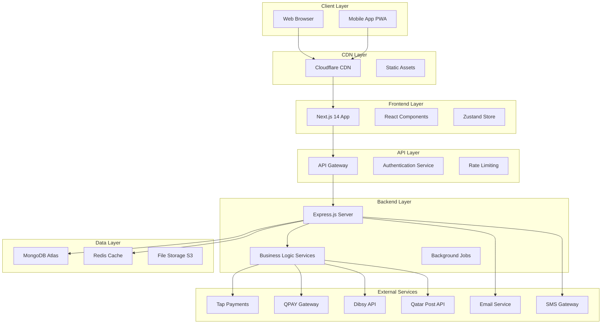
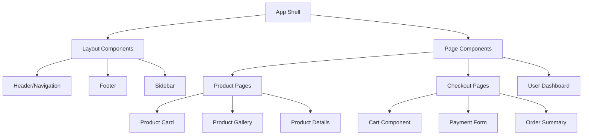

# 🏗️ Architecture Documentation

## Table of Contents
- [System Architecture Overview](#system-architecture-overview)
- [Frontend Architecture](#frontend-architecture)
- [Backend Architecture](#backend-architecture)
- [Database Design](#database-design)
- [Payment Gateway Architecture](#payment-gateway-architecture)
- [Security Architecture](#security-architecture)
- [Performance Architecture](#performance-architecture)
- [Localization Architecture](#localization-architecture)
- [Deployment Architecture](#deployment-architecture)
- [Monitoring & Observability](#monitoring--observability)

## System Architecture Overview

### High-Level Architecture


### Key Architectural Principles

1. **Microservices-Ready Monolith**: Start with a modular monolith that can be split into microservices
2. **API-First Design**: All features accessible via REST APIs
3. **Event-Driven Architecture**: Use events for loose coupling
4. **Horizontal Scalability**: Design for easy scaling
5. **Fault Tolerance**: Graceful degradation and circuit breakers
6. **Security by Design**: Security considerations at every layer

## Frontend Architecture

### Component Architecture


### State Management Architecture
```typescript
// Zustand store structure
interface AppState {
  // User state
  user: UserState;
  auth: AuthState;
  
  // Cart state
  cart: CartState;
  checkout: CheckoutState;
  
  // Product state
  products: ProductState;
  search: SearchState;
  filters: FilterState;
  
  // UI state
  ui: UIState;
  locale: LocaleState;
  
  // Payment state
  payment: PaymentState;
}

// Store slices
const useUserStore = create<UserState>()((set) => ({
  user: null,
  isLoading: false,
  error: null,
  
  setUser: (user) => set({ user }),
  clearUser: () => set({ user: null }),
  updateProfile: async (data) => {
    set({ isLoading: true });
    // Update logic
  },
}));
```

### Component Design System
```typescript
// Base component interface
interface BaseComponentProps {
  className?: string;
  locale?: 'en' | 'ar';
  dir?: 'ltr' | 'rtl';
  children?: React.ReactNode;
}

// Button component system
interface ButtonProps extends BaseComponentProps {
  variant: 'primary' | 'secondary' | 'outline' | 'ghost';
  size: 'sm' | 'md' | 'lg' | 'xl';
  loading?: boolean;
  disabled?: boolean;
  onClick?: () => void;
}

// Product card component
interface ProductCardProps extends BaseComponentProps {
  product: Product;
  variant: 'grid' | 'list' | 'featured';
  showQuickView?: boolean;
  showWishlist?: boolean;
  showCompare?: boolean;
}
```

### Routing Architecture
```typescript
// App Router structure (Next.js 14)
app/
├── (auth)/
│   ├── login/
│   └── register/
├── (shop)/
│   ├── products/
│   │   ├── [slug]/
│   │   └── category/[category]/
│   ├── cart/
│   └── checkout/
├── (account)/
│   ├── dashboard/
│   ├── orders/
│   └── profile/
├── (admin)/
│   ├── dashboard/
│   ├── products/
│   └── orders/
├── api/
│   ├── auth/
│   ├── products/
│   ├── orders/
│   └── payments/
└── globals.css
```

## Backend Architecture

### Service Layer Architecture
```typescript
// Service layer structure
interface ProductService {
  findAll(filters: ProductFilters): Promise<Product[]>;
  findById(id: string): Promise<Product | null>;
  create(data: CreateProductData): Promise<Product>;
  update(id: string, data: UpdateProductData): Promise<Product>;
  delete(id: string): Promise<void>;
  search(query: string, filters: SearchFilters): Promise<SearchResult>;
}

interface OrderService {
  create(orderData: CreateOrderData): Promise<Order>;
  findByUserId(userId: string): Promise<Order[]>;
  updateStatus(orderId: string, status: OrderStatus): Promise<Order>;
  cancel(orderId: string, reason: string): Promise<Order>;
}

interface PaymentService {
  processPayment(paymentData: PaymentData): Promise<PaymentResult>;
  refund(transactionId: string, amount: number): Promise<RefundResult>;
  getTransactionStatus(transactionId: string): Promise<TransactionStatus>;
}
```

### API Route Architecture
```typescript
// Standardized API response format
interface ApiResponse<T> {
  success: boolean;
  data?: T;
  error?: string;
  message?: string;
  pagination?: {
    page: number;
    limit: number;
    total: number;
    pages: number;
  };
}

// Error handling middleware
const errorHandler = (error: Error, req: Request, res: Response, next: NextFunction) => {
  console.error('API Error:', error);
  
  if (error instanceof ValidationError) {
    return res.status(400).json({
      success: false,
      error: 'Validation failed',
      details: error.details
    });
  }
  
  if (error instanceof AuthenticationError) {
    return res.status(401).json({
      success: false,
      error: 'Authentication required'
    });
  }
  
  return res.status(500).json({
    success: false,
    error: 'Internal server error'
  });
};
```

### Background Jobs Architecture
```typescript
// Job queue system using Bull
interface JobProcessor {
  name: string;
  processor: (job: Job) => Promise<void>;
  options?: JobOptions;
}

const emailQueue = new Queue('email processing');
const paymentQueue = new Queue('payment processing');
const inventoryQueue = new Queue('inventory updates');

// Job processors
const emailProcessor: JobProcessor = {
  name: 'send-email',
  processor: async (job) => {
    const { to, template, data } = job.data;
    await emailService.send(to, template, data);
  }
};

const paymentProcessor: JobProcessor = {
  name: 'process-payment',
  processor: async (job) => {
    const { orderId, paymentData } = job.data;
    const result = await paymentService.process(paymentData);
    await orderService.updatePaymentStatus(orderId, result);
  }
};
```

## Database Design

### MongoDB Schema Design
```typescript
// Product schema
interface Product {
  _id: ObjectId;
  sku: string;
  name: {
    en: string;
    ar: string;
  };
  description: {
    en: string;
    ar: string;
  };
  price: {
    amount: number;
    currency: 'QAR' | 'USD';
    vatIncluded: boolean;
    originalPrice?: number;
    discount?: {
      type: 'percentage' | 'fixed';
      value: number;
      startDate: Date;
      endDate: Date;
    };
  };
  images: {
    url: string;
    alt: { en: string; ar: string };
    order: number;
  }[];
  categories: ObjectId[];
  specifications: {
    [key: string]: {
      en: string;
      ar: string;
    };
  };
  inventory: {
    inStock: boolean;
    quantity: number;
    lowStockThreshold: number;
    restockDate?: Date;
  };
  seo: {
    title: { en: string; ar: string };
    description: { en: string; ar: string };
    keywords: string[];
    slug: { en: string; ar: string };
  };
  status: 'draft' | 'published' | 'archived';
  featured: boolean;
  tags: string[];
  brand?: string;
  model?: string;
  warranty?: {
    duration: number;
    unit: 'months' | 'years';
    type: 'manufacturer' | 'store';
  };
  createdAt: Date;
  updatedAt: Date;
}

// User schema
interface User {
  _id: ObjectId;
  email: string;
  phone?: string;
  password: string; // hashed
  profile: {
    firstName: string;
    lastName: string;
    avatar?: string;
    dateOfBirth?: Date;
    gender?: 'male' | 'female';
    preferredLanguage: 'en' | 'ar';
  };
  addresses: {
    _id: ObjectId;
    type: 'home' | 'work' | 'other';
    street: string;
    area: string;
    city: string;
    building?: string;
    floor?: string;
    apartment?: string;
    landmark?: string;
    isDefault: boolean;
  }[];
  preferences: {
    currency: 'QAR' | 'USD';
    notifications: {
      email: boolean;
      sms: boolean;
      whatsapp: boolean;
    };
  };
  loyaltyPoints: number;
  status: 'active' | 'inactive' | 'suspended';
  emailVerified: boolean;
  phoneVerified: boolean;
  createdAt: Date;
  updatedAt: Date;
  lastLoginAt?: Date;
}

// Order schema
interface Order {
  _id: ObjectId;
  orderNumber: string;
  userId: ObjectId;
  items: {
    productId: ObjectId;
    sku: string;
    name: { en: string; ar: string };
    price: number;
    quantity: number;
    total: number;
  }[];
  totals: {
    subtotal: number;
    shipping: number;
    vat: number;
    discount: number;
    total: number;
    currency: 'QAR' | 'USD';
  };
  shipping: {
    address: Address;
    method: 'standard' | 'express' | 'same-day';
    trackingNumber?: string;
    estimatedDelivery: Date;
  };
  payment: {
    method: 'tap' | 'qpay' | 'dibsy' | 'stripe';
    status: 'pending' | 'processing' | 'completed' | 'failed' | 'refunded';
    transactionId?: string;
    paidAt?: Date;
  };
  status: 'pending' | 'confirmed' | 'processing' | 'shipped' | 'delivered' | 'cancelled';
  notes?: string;
  cancelReason?: string;
  createdAt: Date;
  updatedAt: Date;
  deliveredAt?: Date;
}
```

### Indexing Strategy
```typescript
// MongoDB indexes for optimal performance
const productIndexes = [
  { 'name.en': 'text', 'name.ar': 'text', 'description.en': 'text', 'description.ar': 'text' },
  { categories: 1 },
  { 'price.amount': 1 },
  { status: 1, featured: 1 },
  { sku: 1 },
  { 'seo.slug.en': 1 },
  { 'seo.slug.ar': 1 },
  { createdAt: -1 },
  { 'inventory.inStock': 1, 'inventory.quantity': 1 }
];

const userIndexes = [
  { email: 1 },
  { phone: 1 },
  { 'profile.firstName': 1, 'profile.lastName': 1 },
  { createdAt: -1 }
];

const orderIndexes = [
  { userId: 1, createdAt: -1 },
  { orderNumber: 1 },
  { status: 1 },
  { 'payment.status': 1 },
  { createdAt: -1 }
];
```

## Payment Gateway Architecture

### Payment Abstraction Layer
```typescript
// Payment gateway interface
interface PaymentGateway {
  name: string;
  processPayment(data: PaymentData): Promise<PaymentResult>;
  refund(transactionId: string, amount: number): Promise<RefundResult>;
  getTransactionStatus(transactionId: string): Promise<TransactionStatus>;
  generatePaymentForm(orderData: OrderData): Promise<PaymentForm>;
  handleWebhook(payload: any, signature: string): Promise<WebhookResult>;
}

// Payment data structures
interface PaymentData {
  amount: number;
  currency: 'QAR' | 'USD';
  orderId: string;
  customer: {
    email: string;
    phone?: string;
    name: string;
  };
  billingAddress: Address;
  returnUrl: string;
  cancelUrl: string;
  metadata?: Record<string, any>;
}

interface PaymentResult {
  success: boolean;
  transactionId: string;
  status: 'pending' | 'completed' | 'failed';
  redirectUrl?: string;
  error?: string;
  gatewayResponse?: any;
}
```

### Payment Gateway Implementations
```typescript
// Tap Payments implementation
class TapPaymentGateway implements PaymentGateway {
  name = 'tap';
  
  async processPayment(data: PaymentData): Promise<PaymentResult> {
    try {
      const response = await fetch('https://api.tap.company/v2/charges', {
        method: 'POST',
        headers: {
          'Authorization': `Bearer ${process.env.TAP_SECRET_KEY}`,
          'Content-Type': 'application/json'
        },
        body: JSON.stringify({
          amount: data.amount,
          currency: data.currency,
          threeDSecure: true,
          save_card: false,
          description: `Order ${data.orderId}`,
          statement_descriptor: 'Picksmart Stores',
          metadata: {
            orderId: data.orderId,
            ...data.metadata
          },
          reference: {
            transaction: data.orderId,
            order: data.orderId
          },
          receipt: {
            email: true,
            sms: true
          },
          customer: {
            first_name: data.customer.name.split(' ')[0],
            last_name: data.customer.name.split(' ').slice(1).join(' '),
            email: data.customer.email,
            phone: {
              country_code: '974',
              number: data.customer.phone
            }
          },
          source: {
            id: 'src_card'
          },
          post: {
            url: `${process.env.BASE_URL}/api/webhooks/tap`
          },
          redirect: {
            url: data.returnUrl
          }
        })
      });
      
      const result = await response.json();
      
      return {
        success: response.ok,
        transactionId: result.id,
        status: this.mapTapStatus(result.status),
        redirectUrl: result.transaction?.url,
        gatewayResponse: result
      };
    } catch (error) {
      return {
        success: false,
        transactionId: '',
        status: 'failed',
        error: error.message
      };
    }
  }
  
  private mapTapStatus(tapStatus: string): 'pending' | 'completed' | 'failed' {
    switch (tapStatus) {
      case 'INITIATED':
      case 'PENDING':
        return 'pending';
      case 'CAPTURED':
        return 'completed';
      default:
        return 'failed';
    }
  }
}

// QPAY implementation
class QPayGateway implements PaymentGateway {
  name = 'qpay';
  
  async processPayment(data: PaymentData): Promise<PaymentResult> {
    // QPAY implementation
    // Similar structure but different API calls
  }
}
```

### Payment Routing Logic
```typescript
// Payment gateway router
class PaymentRouter {
  private gateways: Map<string, PaymentGateway> = new Map();
  
  constructor() {
    this.gateways.set('tap', new TapPaymentGateway());
    this.gateways.set('qpay', new QPayGateway());
    this.gateways.set('dibsy', new DibsyGateway());
    this.gateways.set('stripe', new StripeGateway());
  }
  
  async processPayment(
    gatewayName: string,
    paymentData: PaymentData
  ): Promise<PaymentResult> {
    const gateway = this.gateways.get(gatewayName);
    
    if (!gateway) {
      throw new Error(`Payment gateway ${gatewayName} not found`);
    }
    
    // Add logging and monitoring
    console.log(`Processing payment via ${gatewayName}`, {
      orderId: paymentData.orderId,
      amount: paymentData.amount,
      currency: paymentData.currency
    });
    
    const result = await gateway.processPayment(paymentData);
    
    // Log result
    console.log(`Payment result from ${gatewayName}`, {
      orderId: paymentData.orderId,
      success: result.success,
      transactionId: result.transactionId
    });
    
    return result;
  }
  
  // Fallback payment processing
  async processWithFallback(
    preferredGateway: string,
    fallbackGateways: string[],
    paymentData: PaymentData
  ): Promise<PaymentResult> {
    // Try preferred gateway first
    try {
      return await this.processPayment(preferredGateway, paymentData);
    } catch (error) {
      console.error(`Payment failed with ${preferredGateway}`, error);
    }
    
    // Try fallback gateways
    for (const gateway of fallbackGateways) {
      try {
        return await this.processPayment(gateway, paymentData);
      } catch (error) {
        console.error(`Fallback payment failed with ${gateway}`, error);
      }
    }
    
    throw new Error('All payment gateways failed');
  }
}
```

## Security Architecture

### Authentication & Authorization
```typescript
// JWT token structure
interface JWTPayload {
  userId: string;
  email: string;
  role: 'customer' | 'admin' | 'staff';
  permissions: string[];
  iat: number;
  exp: number;
}

// Role-based access control
const permissions = {
  customer: [
    'read:own-profile',
    'update:own-profile',
    'read:own-orders',
    'create:order',
    'cancel:own-order'
  ],
  staff: [
    'read:products',
    'update:products',
    'read:orders',
    'update:order-status'
  ],
  admin: [
    'create:products',
    'delete:products',
    'read:users',
    'update:users',
    'read:analytics',
    'manage:system'
  ]
};

// Middleware for route protection
const requireAuth = (requiredPermission?: string) => {
  return async (req: Request, res: Response, next: NextFunction) => {
    try {
      const token = req.headers.authorization?.replace('Bearer ', '');
      
      if (!token) {
        return res.status(401).json({ error: 'Authentication required' });
      }
      
      const payload = jwt.verify(token, process.env.JWT_SECRET) as JWTPayload;
      
      if (requiredPermission && !payload.permissions.includes(requiredPermission)) {
        return res.status(403).json({ error: 'Insufficient permissions' });
      }
      
      req.user = payload;
      next();
    } catch (error) {
      return res.status(401).json({ error: 'Invalid token' });
    }
  };
};
```

### Data Encryption & PCI Compliance
```typescript
// Encryption utilities
class EncryptionService {
  private readonly algorithm = 'aes-256-gcm';
  private readonly key = Buffer.from(process.env.ENCRYPTION_KEY, 'hex');
  
  encrypt(text: string): { encrypted: string; iv: string; tag: string } {
    const iv = crypto.randomBytes(16);
    const cipher = crypto.createCipher(this.algorithm, this.key);
    cipher.setAAD(Buffer.from('picksmart-stores'));
    
    let encrypted = cipher.update(text, 'utf8', 'hex');
    encrypted += cipher.final('hex');
    
    const tag = cipher.getAuthTag();
    
    return {
      encrypted,
      iv: iv.toString('hex'),
      tag: tag.toString('hex')
    };
  }
  
  decrypt(encryptedData: { encrypted: string; iv: string; tag: string }): string {
    const decipher = crypto.createDecipherGCM(this.algorithm, this.key);
    decipher.setAuthTag(Buffer.from(encryptedData.tag, 'hex'));
    decipher.setAAD(Buffer.from('picksmart-stores'));
    
    let decrypted = decipher.update(encryptedData.encrypted, 'hex', 'utf8');
    decrypted += decipher.final('utf8');
    
    return decrypted;
  }
}

// PCI DSS compliance measures
const pciCompliance = {
  // Never store full card numbers
  tokenizeCard: async (cardNumber: string) => {
    // Use payment gateway tokenization
    return await paymentGateway.createToken(cardNumber);
  },
  
  // Secure data transmission
  encryptSensitiveData: (data: any) => {
    const encryption = new EncryptionService();
    return encryption.encrypt(JSON.stringify(data));
  },
  
  // Access logging
  logAccess: (userId: string, resource: string, action: string) => {
    console.log(`[ACCESS] ${userId} ${action} ${resource}`, {
      timestamp: new Date().toISOString(),
      userId,
      resource,
      action,
      ip: req.ip,
      userAgent: req.get('User-Agent')
    });
  }
};
```

## Performance Architecture

### Caching Strategy
```typescript
// Multi-layer caching
interface CacheLayer {
  name: string;
  ttl: number;
  get(key: string): Promise<any>;
  set(key: string, value: any, ttl?: number): Promise<void>;
  delete(key: string): Promise<void>;
}

// Redis cache implementation
class RedisCache implements CacheLayer {
  name = 'redis';
  ttl = 3600; // 1 hour default
  
  constructor(private client: Redis) {}
  
  async get(key: string): Promise<any> {
    const value = await this.client.get(key);
    return value ? JSON.parse(value) : null;
  }
  
  async set(key: string, value: any, ttl = this.ttl): Promise<void> {
    await this.client.setex(key, ttl, JSON.stringify(value));
  }
  
  async delete(key: string): Promise<void> {
    await this.client.del(key);
  }
}

// Cache strategy for different data types
const cacheStrategy = {
  products: {
    key: (id: string) => `product:${id}`,
    ttl: 3600, // 1 hour
    tags: ['products']
  },
  categories: {
    key: () => 'categories:all',
    ttl: 7200, // 2 hours
    tags: ['categories']
  },
  user_profile: {
    key: (userId: string) => `user:${userId}`,
    ttl: 1800, // 30 minutes
    tags: ['users']
  },
  search_results: {
    key: (query: string, filters: string) => `search:${query}:${filters}`,
    ttl: 900, // 15 minutes
    tags: ['search']
  }
};
```

### Database Optimization
```typescript
// Connection pooling and optimization
const mongoConfig = {
  maxPoolSize: 100,
  minPoolSize: 5,
  maxIdleTimeMS: 30000,
  serverSelectionTimeoutMS: 5000,
  socketTimeoutMS: 45000,
  bufferMaxEntries: 0,
  useNewUrlParser: true,
  useUnifiedTopology: true
};

// Query optimization
class OptimizedProductService {
  async findProducts(filters: ProductFilters): Promise<Product[]> {
    const pipeline = [];
    
    // Match stage
    const matchStage: any = { status: 'published' };
    
    if (filters.category) {
      matchStage.categories = new ObjectId(filters.category);
    }
    
    if (filters.priceRange) {
      matchStage['price.amount'] = {
        $gte: filters.priceRange.min,
        $lte: filters.priceRange.max
      };
    }
    
    if (filters.search) {
      matchStage.$text = { $search: filters.search };
    }
    
    pipeline.push({ $match: matchStage });
    
    // Lookup categories
    pipeline.push({
      $lookup: {
        from: 'categories',
        localField: 'categories',
        foreignField: '_id',
        as: 'categoryDetails'
      }
    });
    
    // Sort stage
    const sortStage: any = {};
    switch (filters.sort) {
      case 'price_asc':
        sortStage['price.amount'] = 1;
        break;
      case 'price_desc':
        sortStage['price.amount'] = -1;
        break;
      case 'newest':
        sortStage.createdAt = -1;
        break;
      default:
        sortStage.featured = -1;
        sortStage.createdAt = -1;
    }
    pipeline.push({ $sort: sortStage });
    
    // Pagination
    if (filters.skip) {
      pipeline.push({ $skip: filters.skip });
    }
    if (filters.limit) {
      pipeline.push({ $limit: filters.limit });
    }
    
    return await Product.aggregate(pipeline);
  }
}
```

## Localization Architecture

### i18n Implementation
```typescript
// Translation structure
interface TranslationStructure {
  common: {
    buttons: Record<string, string>;
    navigation: Record<string, string>;
    messages: Record<string, string>;
  };
  products: {
    labels: Record<string, string>;
    categories: Record<string, string>;
    attributes: Record<string, string>;
  };
  checkout: {
    steps: Record<string, string>;
    payment: Record<string, string>;
    shipping: Record<string, string>;
  };
  errors: Record<string, string>;
  validation: Record<string, string>;
}

// Dynamic translation loading
class TranslationService {
  private cache = new Map<string, any>();
  
  async loadTranslations(locale: 'en' | 'ar', namespace: string): Promise<any> {
    const cacheKey = `${locale}:${namespace}`;
    
    if (this.cache.has(cacheKey)) {
      return this.cache.get(cacheKey);
    }
    
    try {
      const translations = await import(`../locales/${locale}/${namespace}.json`);
      this.cache.set(cacheKey, translations.default);
      return translations.default;
    } catch (error) {
      console.error(`Failed to load translations for ${locale}:${namespace}`, error);
      return {};
    }
  }
  
  async translate(key: string, locale: 'en' | 'ar', variables?: Record<string, any>): Promise<string> {
    const [namespace, ...keyParts] = key.split('.');
    const translationKey = keyParts.join('.');
    
    const translations = await this.loadTranslations(locale, namespace);
    let value = this.getNestedValue(translations, translationKey);
    
    // Fallback to English if Arabic translation not found
    if (!value && locale === 'ar') {
      const enTranslations = await this.loadTranslations('en', namespace);
      value = this.getNestedValue(enTranslations, translationKey);
    }
    
    // Variable substitution
    if (value && variables) {
      Object.entries(variables).forEach(([varKey, varValue]) => {
        value = value.replace(`{{${varKey}}}`, varValue);
      });
    }
    
    return value || key;
  }
  
  private getNestedValue(obj: any, path: string): string {
    return path.split('.').reduce((current, key) => current?.[key], obj);
  }
}
```

### RTL Support Implementation
```typescript
// RTL detection and styling
class RTLService {
  static isRTL(locale: string): boolean {
    return locale === 'ar';
  }
  
  static getDirection(locale: string): 'ltr' | 'rtl' {
    return this.isRTL(locale) ? 'rtl' : 'ltr';
  }
  
  static getTextAlign(locale: string): 'left' | 'right' {
    return this.isRTL(locale) ? 'right' : 'left';
  }
  
  static generateRTLClasses(locale: string): string {
    const classes = [];
    
    if (this.isRTL(locale)) {
      classes.push('rtl', 'text-right', 'dir-rtl');
    } else {
      classes.push('ltr', 'text-left', 'dir-ltr');
    }
    
    return classes.join(' ');
  }
}

// CSS-in-JS RTL utilities
const createRTLStyles = (locale: 'en' | 'ar') => ({
  direction: RTLService.getDirection(locale),
  textAlign: RTLService.getTextAlign(locale) as 'left' | 'right',
  paddingLeft: locale === 'ar' ? '0' : '1rem',
  paddingRight: locale === 'ar' ? '1rem' : '0',
  marginLeft: locale === 'ar' ? '0' : 'auto',
  marginRight: locale === 'ar' ? 'auto' : '0',
});
```

## Deployment Architecture

### Container Architecture
```dockerfile
# Multi-stage Dockerfile for production
FROM node:20-alpine AS base
WORKDIR /app
COPY package*.json ./
RUN npm ci --only=production && npm cache clean --force

FROM node:20-alpine AS build
WORKDIR /app
COPY package*.json ./
RUN npm ci
COPY . .
RUN npm run build

FROM node:20-alpine AS runtime
WORKDIR /app
COPY --from=base /app/node_modules ./node_modules
COPY --from=build /app/.next ./.next
COPY --from=build /app/public ./public
COPY --from=build /app/package.json ./package.json

EXPOSE 3000
CMD ["npm", "start"]
```

### Infrastructure as Code
```yaml
# docker-compose.yml for development
version: '3.8'

services:
  app:
    build: .
    ports:
      - "3000:3000"
    environment:
      - NODE_ENV=development
      - DATABASE_URL=mongodb://mongo:27017/picksmart
      - REDIS_URL=redis://redis:6379
    depends_on:
      - mongo
      - redis

  mongo:
    image: mongo:7.2
    ports:
      - "27017:27017"
    volumes:
      - mongo_data:/data/db

  redis:
    image: redis:7.2-alpine
    ports:
      - "6379:6379"
    volumes:
      - redis_data:/data

volumes:
  mongo_data:
  redis_data:
```

### Production Deployment Strategy
```yaml
# Kubernetes deployment
apiVersion: apps/v1
kind: Deployment
metadata:
  name: picksmart-web
spec:
  replicas: 3
  selector:
    matchLabels:
      app: picksmart-web
  template:
    metadata:
      labels:
        app: picksmart-web
    spec:
      containers:
      - name: web
        image: picksmart/web:latest
        ports:
        - containerPort: 3000
        env:
        - name: NODE_ENV
          value: "production"
        - name: DATABASE_URL
          valueFrom:
            secretKeyRef:
              name: picksmart-secrets
              key: database-url
        resources:
          requests:
            memory: "256Mi"
            cpu: "250m"
          limits:
            memory: "512Mi"
            cpu: "500m"
---
apiVersion: v1
kind: Service
metadata:
  name: picksmart-web-service
spec:
  selector:
    app: picksmart-web
  ports:
  - port: 80
    targetPort: 3000
  type: LoadBalancer
```

## Monitoring & Observability

### Logging Architecture
```typescript
// Structured logging with Winston
import winston from 'winston';

const logger = winston.createLogger({
  level: 'info',
  format: winston.format.combine(
    winston.format.timestamp(),
    winston.format.errors({ stack: true }),
    winston.format.json()
  ),
  defaultMeta: { service: 'picksmart-api' },
  transports: [
    new winston.transports.File({ filename: 'error.log', level: 'error' }),
    new winston.transports.File({ filename: 'combined.log' }),
    new winston.transports.Console({
      format: winston.format.simple()
    })
  ]
});

// Request logging middleware
const requestLogger = (req: Request, res: Response, next: NextFunction) => {
  const start = Date.now();
  
  res.on('finish', () => {
    const duration = Date.now() - start;
    logger.info('HTTP Request', {
      method: req.method,
      url: req.url,
      status: res.statusCode,
      duration,
      userAgent: req.get('User-Agent'),
      ip: req.ip,
      userId: req.user?.userId
    });
  });
  
  next();
};
```

### Metrics Collection
```typescript
// Prometheus metrics
import promClient from 'prom-client';

// Register default metrics
promClient.register.clear();
promClient.collectDefaultMetrics();

// Custom metrics
const httpRequestDuration = new promClient.Histogram({
  name: 'http_request_duration_seconds',
  help: 'HTTP request duration in seconds',
  labelNames: ['method', 'route', 'status']
});

const databaseQueryDuration = new promClient.Histogram({
  name: 'database_query_duration_seconds',
  help: 'Database query duration in seconds',
  labelNames: ['operation', 'collection']
});

const paymentProcessingCount = new promClient.Counter({
  name: 'payment_processing_total',
  help: 'Total number of payment processing attempts',
  labelNames: ['gateway', 'status']
});

// Metrics middleware
const metricsMiddleware = (req: Request, res: Response, next: NextFunction) => {
  const start = Date.now();
  
  res.on('finish', () => {
    const duration = (Date.now() - start) / 1000;
    httpRequestDuration
      .labels(req.method, req.route?.path || req.path, res.statusCode.toString())
      .observe(duration);
  });
  
  next();
};
```

### Health Checks
```typescript
// Health check endpoints
interface HealthCheck {
  name: string;
  status: 'healthy' | 'unhealthy';
  message?: string;
  responseTime?: number;
}

class HealthCheckService {
  async checkDatabase(): Promise<HealthCheck> {
    const start = Date.now();
    try {
      await mongoose.connection.db.admin().ping();
      return {
        name: 'database',
        status: 'healthy',
        responseTime: Date.now() - start
      };
    } catch (error) {
      return {
        name: 'database',
        status: 'unhealthy',
        message: error.message
      };
    }
  }
  
  async checkRedis(): Promise<HealthCheck> {
    const start = Date.now();
    try {
      await redis.ping();
      return {
        name: 'redis',
        status: 'healthy',
        responseTime: Date.now() - start
      };
    } catch (error) {
      return {
        name: 'redis',
        status: 'unhealthy',
        message: error.message
      };
    }
  }
  
  async checkPaymentGateways(): Promise<HealthCheck[]> {
    const checks = await Promise.all([
      this.checkTapPayments(),
      this.checkQPay(),
      this.checkDibsy()
    ]);
    
    return checks;
  }
  
  async getOverallHealth(): Promise<{
    status: 'healthy' | 'degraded' | 'unhealthy';
    checks: HealthCheck[];
  }> {
    const checks = await Promise.all([
      this.checkDatabase(),
      this.checkRedis(),
      ...await this.checkPaymentGateways()
    ]);
    
    const unhealthyCount = checks.filter(check => check.status === 'unhealthy').length;
    
    let status: 'healthy' | 'degraded' | 'unhealthy';
    if (unhealthyCount === 0) {
      status = 'healthy';
    } else if (unhealthyCount <= checks.length / 2) {
      status = 'degraded';
    } else {
      status = 'unhealthy';
    }
    
    return { status, checks };
  }
}
```

---

This architecture documentation provides a comprehensive foundation for building a scalable, secure, and maintainable ecommerce platform for the Qatar market. Each section can be further detailed during implementation phases. 